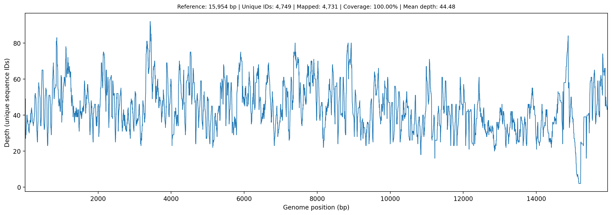

# gbimaculatus-mt-genome-blast-cap3

Companion data and validation notebook for:

> **Gupta YM (2026).** Extending the Targeted BLAST–CAP3 Workflow to Complete Mitochondrial Genome Draft Assembly from Whole-Genome Sequencing Data: *Gryllus bimaculatus* as a Case Study with Documented Obstacles and Solutions.

## Overview

This repository contains the assembled *Gryllus bimaculatus* mitochondrial genome (15,954 bp; 99.574% identity to reference PP230540.1), validation analyses, and the Jupyter notebook used for post-assembly read mapping, coverage depth characterization, and tandem repeat investigation.

The mitochondrial genome was assembled from public WGS data ([SRR35113092](https://www.ncbi.nlm.nih.gov/sra/SRR35113092); BioProject [PRJNA1307968](https://www.ncbi.nlm.nih.gov/bioproject/PRJNA1307968); 362.3M paired-end Illumina NovaSeq 6000 reads) using the targeted BLAST–CAP3 pipeline — a fully web-based approach requiring no local software installation.

## Key Results

| Metric | Value |
|--------|-------|
| Assembly length | 15,954 bp |
| Reference (PP230540.1) | 15,955 bp |
| Pairwise identity | 99.574% |
| Total input reads (BLAST-retrieved) | 6,682 |
| Unique reads (after ID dedup) | 4,749 |
| Mapped reads | 4,731 (99.6%) |
| Genome coverage | **100%** |
| Mean depth | 44.5× |
| Min / Max depth | 2× / 92× |

### Coverage Depth Profile



## Assembly Pipeline (Article Methods)

The assembly was performed using entirely web-based tools:

1. **BLASTN** (NCBI web interface) — Full PP230540.1 reference queried against SRR35113092; max targets = 5,000; word size = 16
2. **CAP3** (Galaxy Europe) — Standard overlap ≥40 bp for coding/RNA regions; reduced overlap 10–15 bp for D-loop
3. **ClustalW** — Mandatory manual inspection of D-loop assembly to verify positional accuracy across tandem repeats
4. **BLASTN validation** — Assembled contig confirmed against nr/nt (E-value = 0.0; bit score = 29,085)

### D-loop Assembly Obstacle

Standard CAP3 parameters failed in the A+T-rich control region (~1,240 bp; positions 14,716–15,955) due to tandem repeat architecture. Reducing the overlap cutoff to 10–15 bp and validating with ClustalW alignment resolved this — a solution transferable to any insect mitogenome.

## Validation Notebook

The Jupyter notebook performs independent post-assembly validation:

- **ID-based read deduplication** across 5 input read files
- **3-tier circular mapping**: exact match → Hamming distance (≤3 mm) → local alignment rescue (≥94% identity)
- **Per-base coverage depth** computation on the circular genome
- **Repeat analysis**: self-dotplots (scatter, heatmap, zoomed) and k-mer spacing analysis confirming tandem repeats at positions ~14,650–15,450 bp

## Repository Contents

```
├── README.md
├── circular_mt_mapping_workflow_dedup_by_id.ipynb  # Validation notebook
│
├── Assembled_gbima.fasta                           # Assembled mitogenome (15,954 bp)
├── merged_sequences.fasta                          # BLAST-retrieved reads
├── fulldump.txt                                    # BLAST-retrieved reads
├── gap_1.txt                                       # Gap-filling reads
├── gap_2.txt                                       # Gap-filling reads
├── seqdumpddd.txt                                  # BLAST-retrieved reads
│
├── merged_reads_deduplicated_by_id.fasta           # Deduplicated merged reads (4,749)
├── final_circular_dedup_by_id_mapping_results.csv  # Per-read mapping table
├── final_circular_dedup_by_id_mapping_summary.txt  # Summary statistics
├── final_circular_coverage_depth.csv               # Per-position depth
└── final_circular_dedup_by_id_coverage_plot.png    # Coverage depth plot
```

## Data Sources

| Resource | Accession |
|----------|-----------|
| WGS source data | [SRR35113092](https://www.ncbi.nlm.nih.gov/sra/SRR35113092) |
| BioProject | [PRJNA1307968](https://www.ncbi.nlm.nih.gov/bioproject/PRJNA1307968) |
| Reference mitogenome | [PP230540.1](https://www.ncbi.nlm.nih.gov/nuccore/PP230540.1) |

## Requirements

To re-run the validation notebook:

```bash
pip install biopython numpy pandas matplotlib
```

- Python 3.8+
- Jupyter Notebook or VS Code with Jupyter extension

## Citation

If you use this data or notebook, please cite:

> Gupta YM (2026). Extending the Targeted BLAST–CAP3 Workflow to Complete Mitochondrial Genome Draft Assembly from Whole-Genome Sequencing Data: *Gryllus bimaculatus* as a Case Study with Documented Obstacles and Solutions.

and the original pipeline:

> Gupta YM (2026). A Targeted BLAST-CAP3 Workflow for Rapid and Reproducible Mitochondrial Gene Assembly From Public Transcriptomes: *Acheta domesticus* as a Model. *Natural Sciences* 6:e70061. https://doi.org/10.1002/ntls.70061

## License

This project is provided for academic and research purposes.
